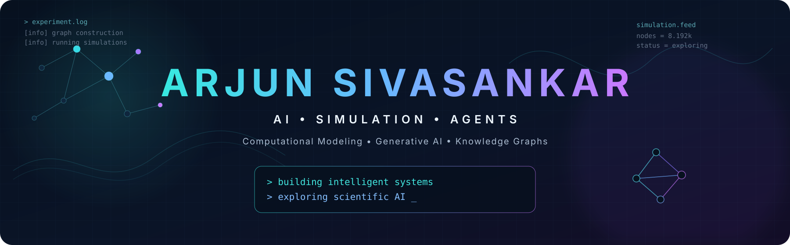
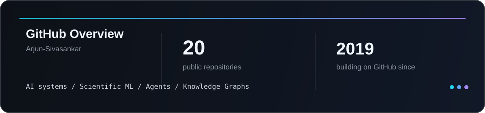

<p align="center">
  
</p>

<p align="center">
  <a href="https://arjun-sivasankar.github.io/ArjunSivasankar.github.io/">Portfolio</a> ·
  <a href="https://www.linkedin.com/in/arjun-sivasankar-381380155/">LinkedIn</a> ·
  <a href="mailto:arjun.sivasankar@gmail.com">Email</a>
</p>

---

## Hi! I'm Arjun Sivasankar

**Computational Modeling Researcher · AI Engineer**

I work at the intersection of **machine learning, scientific computing, simulation, and knowledge-driven systems**.

I am particularly interested in problems where the data is imperfect, the system is complex, and useful solutions require more than a single model call.

```python
arjun = {
    "focus": ["Generative AI", "Scientific ML", "Agents", "Knowledge Graphs"],
    "approach": ["model", "experiment", "measure", "iterate"],
    "interests": ["AI systems", "simulation", "reasoning", "research engineering"]
}
```

---

## Selected Work

<table>
<tr>
<td width="50%" valign="top">

### Medical AI and Knowledge Graphs
**[MasterThesis](https://github.com/Arjun-Sivasankar/MasterThesis)**

Knowledge-aware clinical generation using **MIMIC-IV, UMLS, RAG, FAISS, LLM fine-tuning, semantic mapping, and history-aware pipelines**.

`LLMs` `RAG` `Knowledge Graphs` `Medical AI`

</td>
<td width="50%" valign="top">

### Scientific Machine Learning
**[Conductivity Reconstruction](https://github.com/Arjun-Sivasankar/Conductivity-Reconstruction-using-Invertible-Neural-Networks-after-sensor-reduction)**

Reconstructing conductivity fields with **invertible neural networks** under reduced sensor information.

`Scientific ML` `Inverse Problems` `Neural Networks`

</td>
</tr>
<tr>
<td width="50%" valign="top">

### Agentic Systems
**[AI-Agent-JS](https://github.com/Arjun-Sivasankar/AI-Agent-JS)**

Experiments with AI agents and autonomous workflows, with an emphasis on structured actions and tool-oriented behavior.

`Agents` `JavaScript` `Generative AI`

</td>
<td width="50%" valign="top">

### Computer Vision
**[GTSRB Traffic Classification](https://github.com/Arjun-Sivasankar/GTSRB-TrafficClassification)**

Deep-learning experiments for traffic-sign recognition and visual classification.

`Computer Vision` `Deep Learning` `Classification`

</td>
</tr>
</table>

---

## Technical Stack

<p align="center">
  
</p>

<table>
<tr>
<td width="25%" valign="top"><strong>AI / ML</strong><br><br>PyTorch<br>TensorFlow<br>scikit-learn<br>LLMs & Generative AI<br>RAG<br>Knowledge Graphs<br>Computer Vision</td>
<td width="25%" valign="top"><strong>Engineering</strong><br><br>Python<br>C++<br>Java<br>JavaScript / TypeScript<br>Docker<br>Linux<br>Git</td>
<td width="25%" valign="top"><strong>Data</strong><br><br>Pandas<br>NumPy<br>PostgreSQL<br>SQLite<br>MongoDB<br>Matplotlib<br>FAISS</td>
<td width="25%" valign="top"><strong>Scientific Computing</strong><br><br>MATLAB<br>Simulink<br>COMSOL<br>Computational Modeling<br>Simulation<br>Inverse Problems<br>Scientific ML</td>
</tr>
</table>

<p align="center">
  <code>Cloud: AWS · Azure · Google Cloud</code>
</p>

---

## Engineering Approach

```text
01  understand the system
02  identify the important structure
03  build the smallest useful experiment
04  measure what actually happened
05  iterate until the idea survives contact with reality
```

> Research with rigor. Engineer with purpose.

---

## Current Interests

- AI systems that reason over **structured and unstructured knowledge**
- **Agents** that plan, use tools, and operate inside real workflows
- **Knowledge graphs, retrieval, and generative models**
- Machine learning for **scientific and inverse problems**
- Turning research prototypes into systems that are robust and usable

---

## GitHub Activity

<a href="https://github.com/Arjun-Sivasankar">
  
</a>

<p align="center">
  <a href="https://github.com/Arjun-Sivasankar?tab=repositories">Repositories</a> ·
  <a href="https://github.com/Arjun-Sivasankar?tab=overview">Contribution activity</a>
</p>

---

## Contact

I am always interested in conversations around **AI, agents, scientific machine learning, generative systems, simulation, and research engineering**.

<p align="center">
  <a href="https://www.linkedin.com/in/arjun-sivasankar-381380155/"></a>
  <a href="https://arjun-sivasankar.github.io/ArjunSivasankar.github.io/"></a>
  <a href="mailto:arjun.sivasankar@gmail.com"></a>
</p>
